# Прогнозування успішності стартапів за допомогою інтелектуального аналізу даних

**Виконав:** Пупеза Данііл Ростиславович, І-23

## Мета проєкту

Мета роботи — дослідити фактори, що пов'язані з успішністю стартапів, за допомогою методів інтелектуального аналізу даних та побудувати прогностичну модель, яка класифікує історичний результат компанії.

У межах проєкту реалізовано повний ML-пайплайн:

```text
аудит датасетів → формування target → очищення даних → EDA → навчання моделей → оцінка → інтерпретація факторів
```

## Дані

Основним джерелом даних обрано **Big Startup Success/Fail Dataset** на основі публічних Crunchbase-даних.

Перед вибором основного джерела було перевірено три Kaggle/Crunchbase-набори:

1. `Big Startup Success/Fail Dataset`
2. `Startup Investments Crunchbase`
3. `Startups Companies Dataset`

Основний датасет містить приблизно **66 тис. записів**. Після фільтрації компаній із відомим фінальним статусом сформовано навчальну вибірку з **13 334 спостережень**.

| Клас | Значення target | Опис |
|---|---:|---|
| Success | `1` | Компанія має статус `acquired`, `ipo` або `public` |
| Failure | `0` | Компанія має статус `closed` |

Компанії зі статусом `operating` не включаються в основне навчання, оскільки для них фінальний результат ще невідомий.

## Критерій успіху

Бінарний критерій успіху сформовано так:

```text
success = 1, якщо status ∈ {acquired, ipo, public}
success = 0, якщо status = closed
```

Такий підхід дозволяє уникнути помилкового віднесення активних компаній до класу невдач.

## Ознаки

У моделі використано ознаки, що описують фінансування, ринок, географію та часову динаміку розвитку компанії.

| Група факторів | Ознаки |
|---|---|
| Фінансування | `log_funding_total_usd`, `funding_rounds_num`, `funding_duration_years` |
| Ринок | `category_code` |
| Географія | `country_code`, `state_code`, `region`, `city` |
| Динаміка розвитку | `company_age_years`, `years_to_first_funding` |

### Обмеження щодо факторів команди

У вибраному основному датасеті немає прямих характеристик команди: кількості засновників, досвіду фаундерів, попередніх exit-проєктів, освіти чи розміру команди на ранній стадії. Тому командний фактор у цій версії дослідження не моделюється напряму, а розглядається лише опосередковано через доступні публічні характеристики компанії.

## Структура репозиторію

```text
startup-success-prediction/
├── data/
│   ├── external/              # зовнішні датасети, не обов'язково комітити в Git
│   └── processed/             # очищені дані після запуску pipeline
├── docs/
│   ├── data_audit.md          # аудит датасетів
│   └── project_report_ua.md   # академічний звіт українською мовою
├── models/                    # збережені моделі після запуску pipeline
├── notebooks/
│   └── 01_eda_and_modeling.ipynb
├── reports/
│   ├── figures/               # графіки EDA, оцінки моделей та SHAP
│   ├── metrics.json
│   ├── model_comparison.csv
│   ├── top_features.csv
│   └── used_features.json
├── scripts/
│   └── run_pipeline.py
├── src/
│   └── startup_success/
│       ├── clean_data.py
│       ├── config.py
│       ├── eda.py
│       ├── evaluate.py
│       ├── explain.py
│       ├── features.py
│       ├── train_models.py
│       └── utils.py
├── presentation.md
├── README.md
└── requirements.txt
```

## Запуск проєкту

### 1. Встановлення залежностей

```bash
python -m venv .venv
source .venv/bin/activate
pip install -r requirements.txt
```

Для Windows:

```powershell
python -m venv .venv
.venv\Scripts\activate
pip install -r requirements.txt
```

### 2. Запуск повного pipeline

```bash
python scripts/run_pipeline.py
```

Доступний вибір логіки target:

```bash
python scripts/run_pipeline.py --target clean_exit
python scripts/run_pipeline.py --target proxy
```

Основний режим для звіту — `clean_exit`.

## Моделі

У проєкті навчаються та порівнюються кілька моделей класифікації:

- Logistic Regression
- Random Forest
- Gradient Boosting Classifier
- Hist Gradient Boosting Classifier
- XGBoost, якщо пакет доступний у середовищі

Навчання виконується через `sklearn.Pipeline`, що об'єднує preprocessing та модель. Для оцінки стабільності використовується `StratifiedKFold` cross-validation.

## Результати

Найкращий результат у поточному запуску показала модель **Gradient Boosting Classifier**.

| Метрика | Значення на test set |
|---|---:|
| ROC-AUC | 0.835 |
| F1-score | 0.786 |
| Accuracy | 0.762 |

Ці результати слід трактувати як якість моделі на історичних даних Crunchbase, а не як гарантію точного прогнозування майбутнього стартапу.

## Візуальні результати

### Розподіл цільової змінної

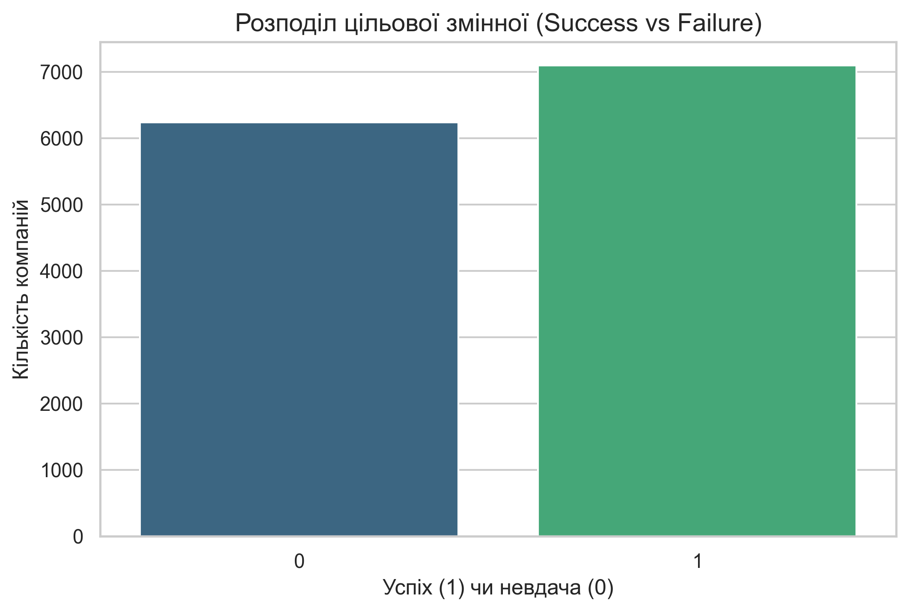

### Розподіл фінансування

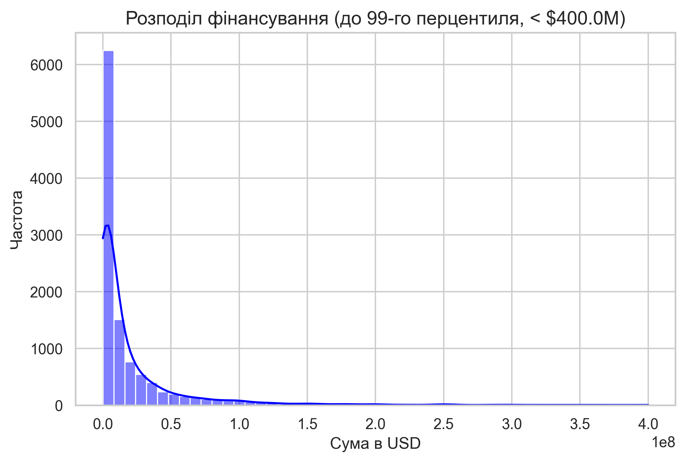

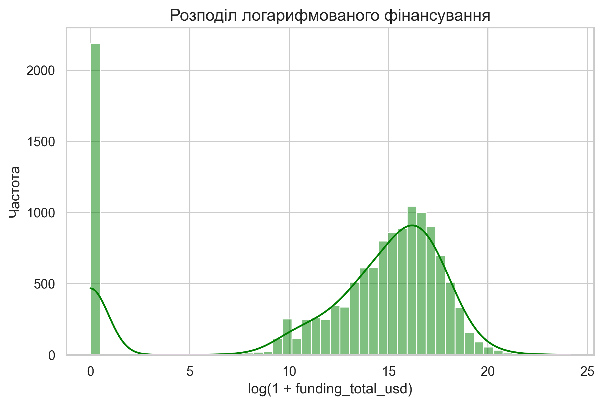

### Зв'язок фінансування та успішності

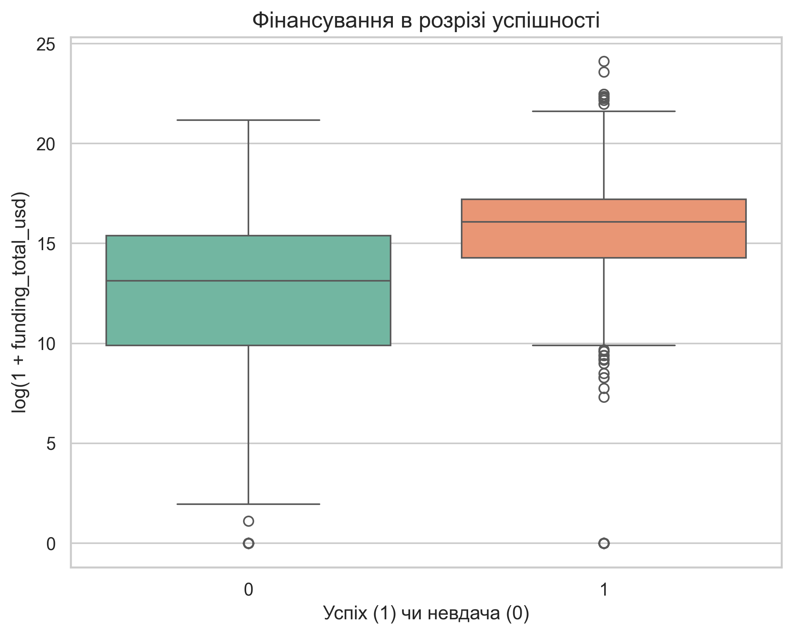

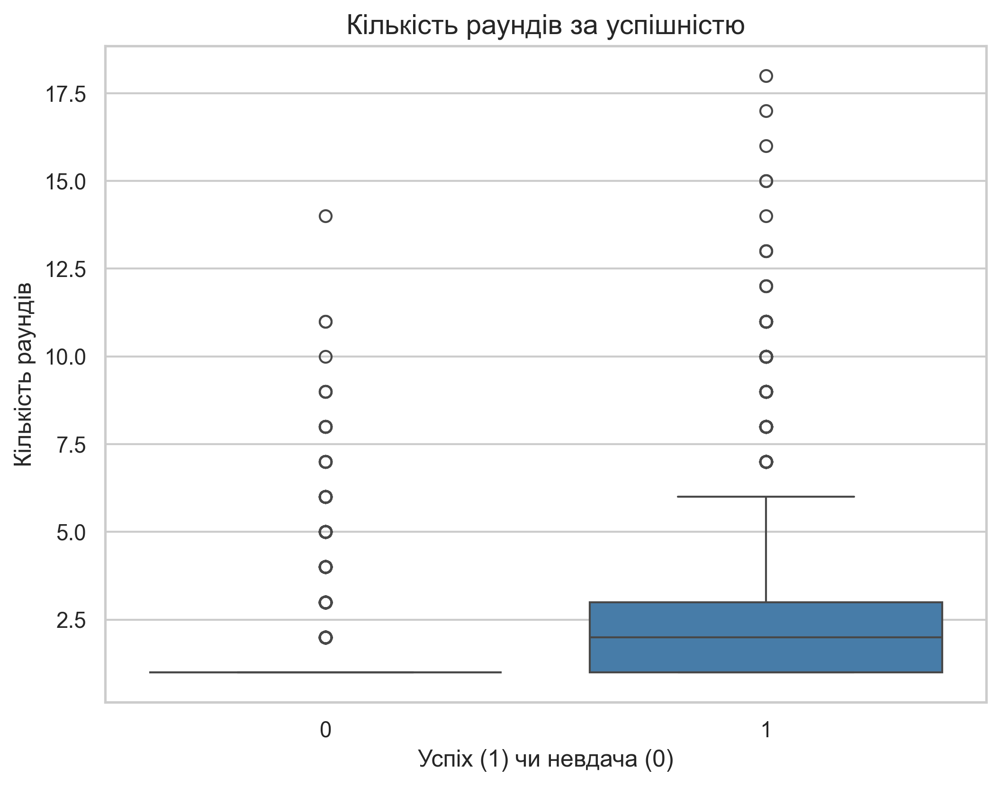

### Ринок і географія

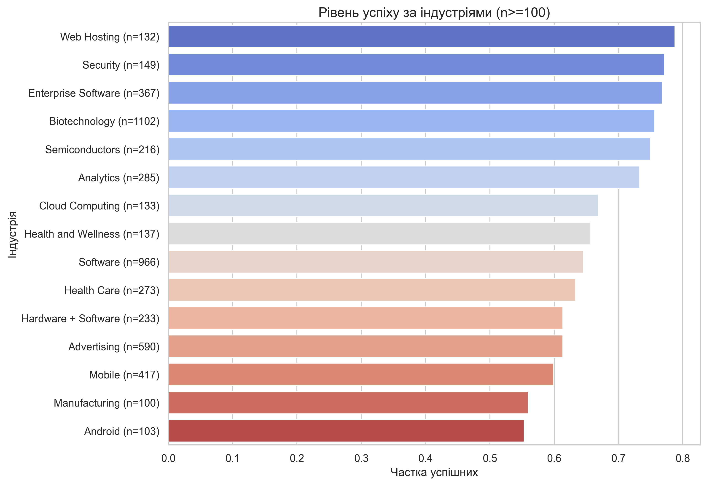

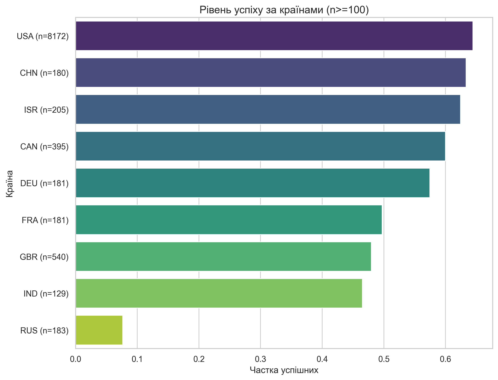

### Оцінка моделі

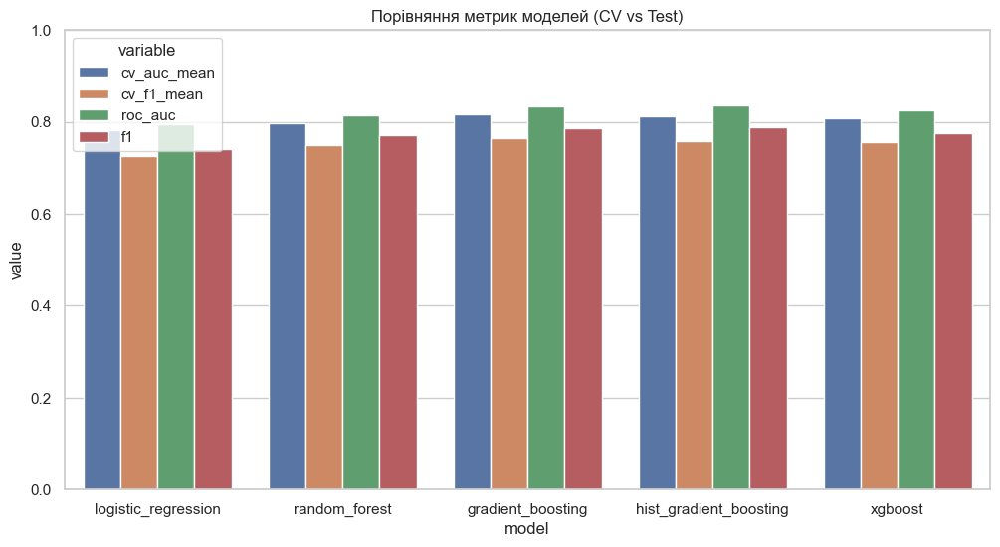

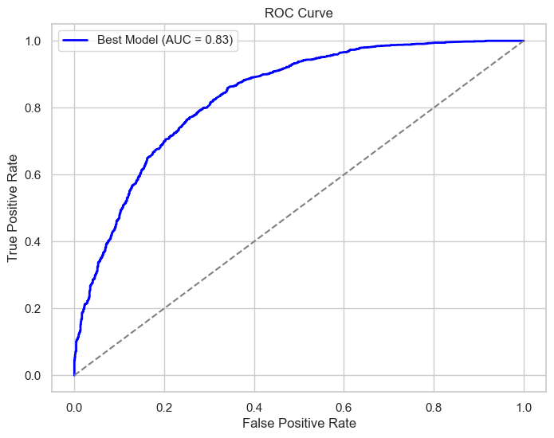

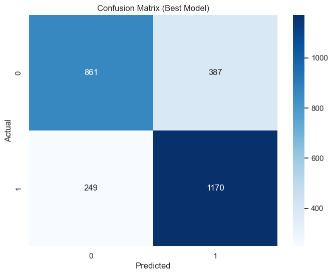

## Топ факторів успіху

Для інтерпретації використано feature importance, permutation importance та SHAP-графіки.

| Фактор | Інтерпретація |
|---|---|
| `log_funding_total_usd` | Найсильніший статистичний предиктор у даних; більший обсяг фінансування пов'язаний із більшою ймовірністю exit-результату |
| `company_age_years` | Тривалість існування компанії пов'язана з шансом дійти до acquisition/IPO |
| `funding_rounds_num` | Більша кількість раундів часто відповідає вищій зрілості та інвесторській підтримці |
| `funding_duration_years` | Довший цикл залучення капіталу може свідчити про стабільний розвиток |
| `category_code`, `country_code` | Ринок і географія відображають відмінності між індустріями та startup-екосистемами |

Окремо важливо: ознаки на кшталт `category_code_unknown`, `country_code_unknown`, `region_unknown` або `city_unknown` не слід трактувати як бізнес-фактори. Це **сигнали якості даних**: вони показують, що неповнота профілю в Crunchbase також може корелювати з результатом компанії.

### SHAP-графіки

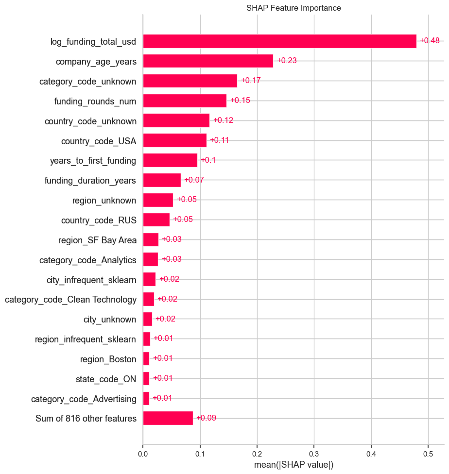

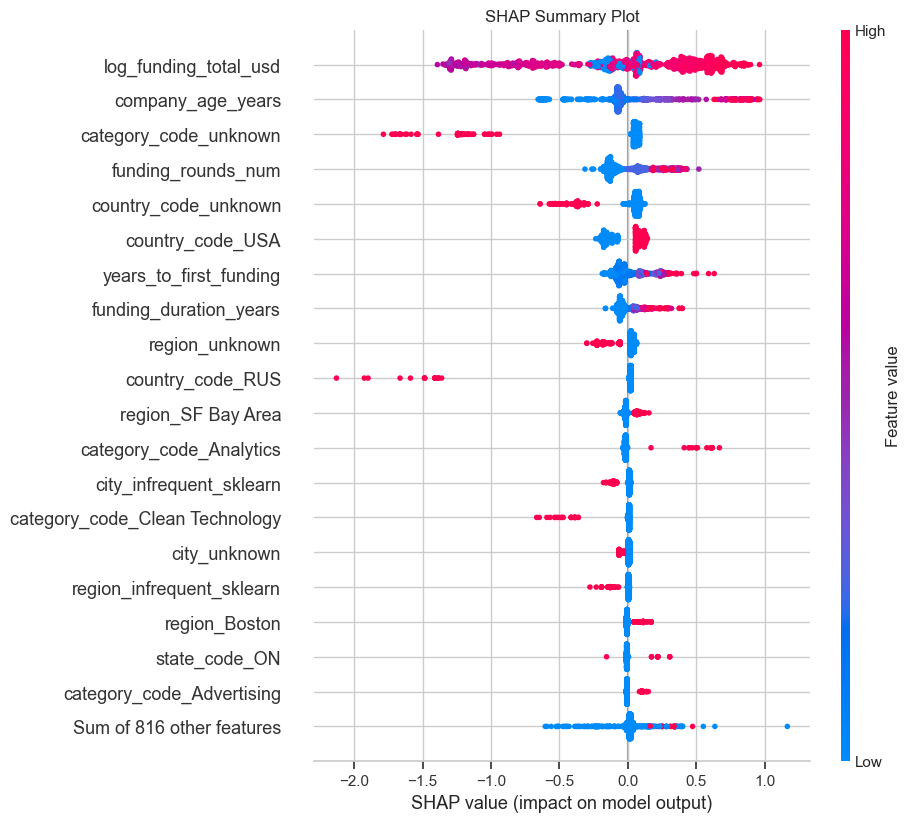

## Методологічні обмеження

1. **Historical association, not pure early prediction.** Модель виявляє історичні зв'язки між ознаками та результатом стартапу. Частина ознак може бути відома лише після кількох років розвитку компанії.
2. **Data leakage risk.** `log_funding_total_usd`, `funding_rounds_num`, `funding_duration_years` та `company_age_years` можуть містити постфактумну інформацію про розвиток компанії.
3. **Crunchbase/Kaggle bias.** Публічні дані краще покривають компанії зі США, технологічні сектори та стартапи з вищою публічністю.
4. **Відсутність прямих team-факторів.** У вибраному датасеті немає достатніх характеристик команди, тому цей блок задачі покрито лише частково.
5. **Кореляція не дорівнює причинності.** Висока важливість ознаки в моделі не означає причинно-наслідковий вплив.

## Висновок

Проєкт демонструє повний цикл інтелектуального аналізу даних для задачі прогнозування історичного результату стартапів. Було сформовано бінарний критерій успіху, підготовлено навчальний датасет із публічних джерел, побудовано EDA, навчено декілька моделей класифікації, оцінено їх за ROC-AUC і F1 та визначено найбільш впливові фактори за допомогою feature importance і SHAP.

Найважливішими факторами виявилися фінансування, тривалість розвитку, кількість раундів, ринок та географія. Результати мають дослідницький характер і потребують обережної інтерпретації через можливий leakage та обмеження публічних даних.
